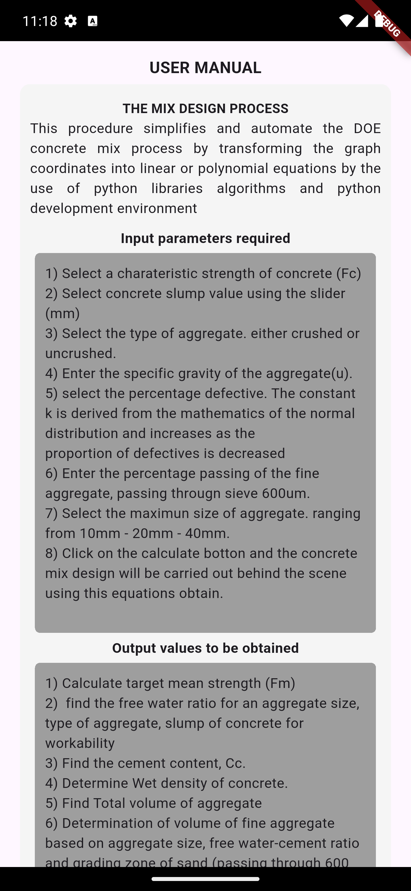
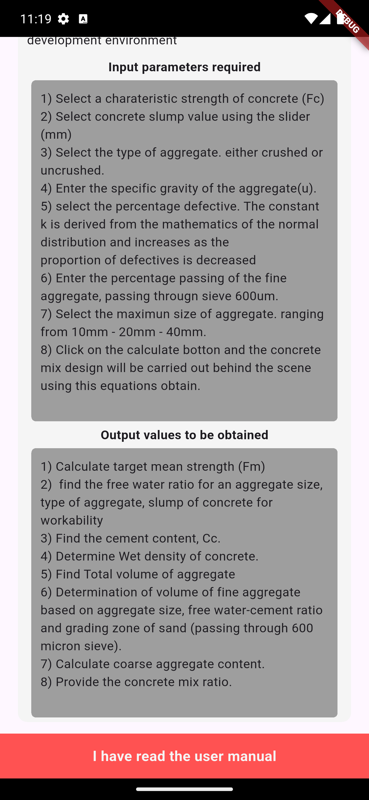
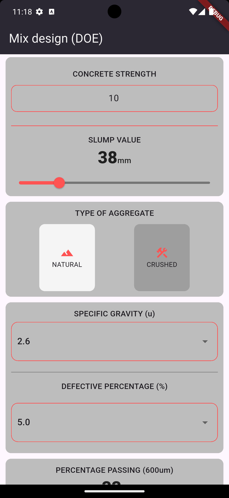
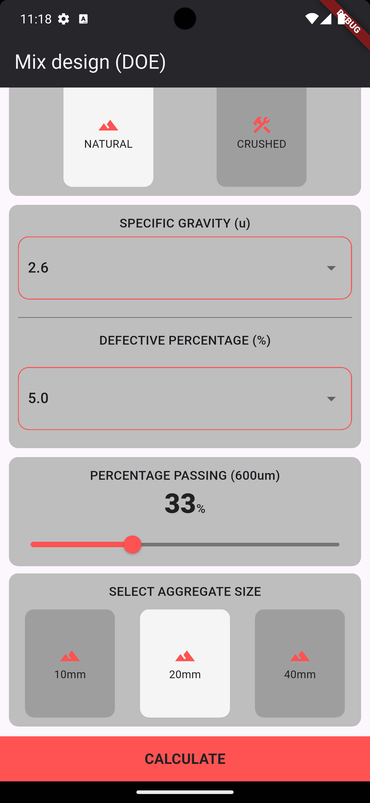
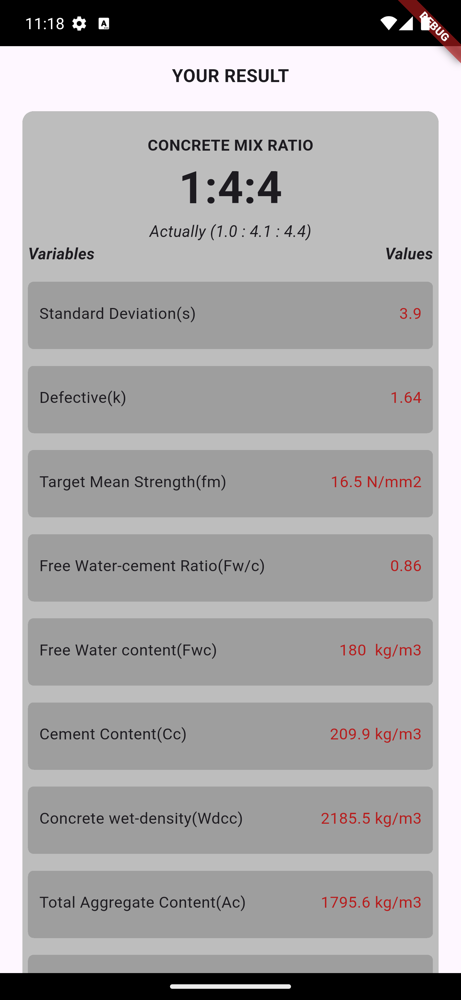
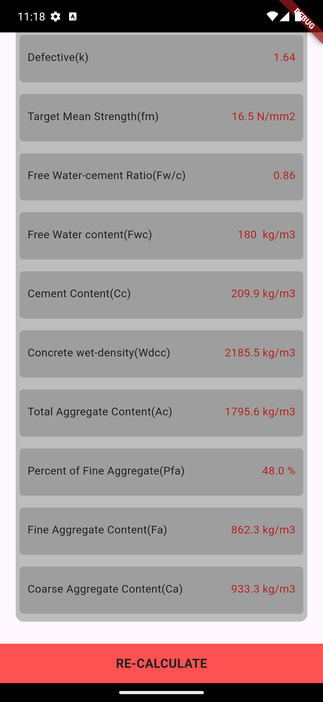

# 🏗️ DoE Concrete Mix Design App

A Flutter-based mobile application implementing the Design of Experiments (DoE) approach to generate optimized concrete mix designs. This tool computes key mix parameters—water content, cement content, aggregate proportions—based on user inputs (target strength, slump, aggregate properties) using statistical formulas.

---

---

## 📸 Screenshots

<div align="center">
  
  
  
  
    
  
</div>

---

## 📱 Built With

- **Flutter** – UI toolkit for cross-platform mobile development
- **Dart** – Programming language

---

## 📂 Project Structure

```text
.dart_tool/      # Flutter build files
.idea/           # IDE config
android/         # Android native code
ios/             # iOS native code
lib/
├── core/
│   └── utils/
│       └── constants.dart       # App-wide constants
├── features/
│   └── doe/
│       ├── data/
│       ├── domain/
│       │   └── doe_calculation_brain.dart  # Calculation logic
│       └── presentation/
│           ├── pages/
│           │   ├── input_page.dart         # Input form UI
│           │   ├── calculate_page.dart     # Trigger calculations
│           │   └── result_page.dart        # Display results
│           └── widgets/
│               └── components.dart         # Reusable UI widgets
├── manual/
│   └── presentation/
│       └── pages/
│           ├── manual_page.dart            # User manual UI
│           └── input_page.dart             # Alternate input UI
├── main.dart                               # App entrypoint
└── README.md                               # This file
screenshots/        # App screenshots
test/               # Unit and widget tests
pubspec.yaml        # Dependencies and assets

```

---

## 🎯 Features

- **User Inputs**: Characteristic strength (f<sub>c</sub>), slump, aggregate type & size, specific gravity, percentage defective, fineness (passing 600µm).
- **DoE Calculations**: Statistical formulas to compute:

  - Standard deviation (s)
  - Defective constant (k)
  - Target mean strength (f<sub>m</sub>)
  - Free water ratio (FWR) & content (F<sub>wc</sub>)
  - Cement content (C<sub>c</sub>)
  - Wet density of concrete (ρ<sub>w</sub>)
  - Total aggregate (A<sub>c</sub>), fine & coarse proportions
  - Mix ratios

- **Modular Architecture**: Business logic separated in `doe_calculation_brain.dart` for testability and future extension.
- **UI Workflow**: Input → Calculate → Results displayed clearly with units and breakdown.
- **User Manual**: Built-in reference explaining each input and output.

---

## 🚀 Getting Started

1. **Clone the repo**

   ```bash
   git clone https://github.com/chi2785443/doe_concrete_mix_designer.git
   cd doe_concrete_mix_designer
   ```

2. **Install dependencies**

   ```bash
   flutter pub get
   ```

3. **Run the app**

   ```bash
   flutter run
   ```

4. **Run tests**

   ```bash
   flutter test
   ```

---

## 🧮 Calculation Logic Overview

The `DoeCalculationBrain` class (in `lib/features/doe/domain/doe_calculation_brain.dart`) encapsulates all mix design formulas. Key methods:

```dart
final brain = DoeCalculationBrain(
  fc: 30.0,
  slump: 50,
  aggtype: 2,          // 1 = uncrushed, 2 = crushed
  sg: 2.65,
  defective: 2.5,
  agg_size: 20,
  Pp: 10,              // % passing 600µm
);

final s     = brain.getStandardDeviation();
final k     = brain.getDefective();
final fm    = brain.getTargetMeanStrength();
final FWR   = brain.getFreeWaterRatio();
final Fwc   = brain.getFreeWaterContent();
final Cc    = brain.getCementContent();
final Wdcc  = brain.getWetdensityofConcrete();
final Ac    = brain.getTotalAggregateContent();
final Pfa   = brain.getPercentageofFineAggregate();
final Fa    = brain.getFineAggregateContent();
final Ca    = brain.getCoarseAggregateContent();
final ratio = brain.getCementRatio();
```


## 👨‍💻 Contributing

Contributions are welcome! Feel free to open issues or submit pull requests.

---

## 📄 License

This project is licensed under the MIT License. See [LICENSE](LICENSE) for details.
